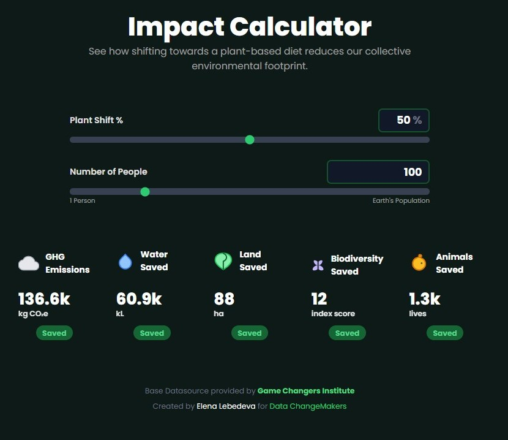
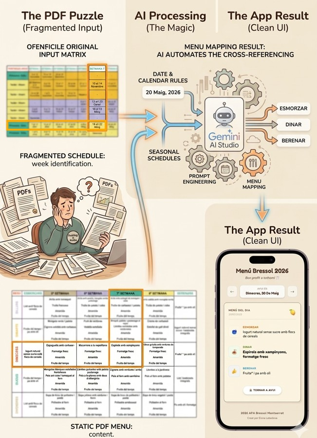
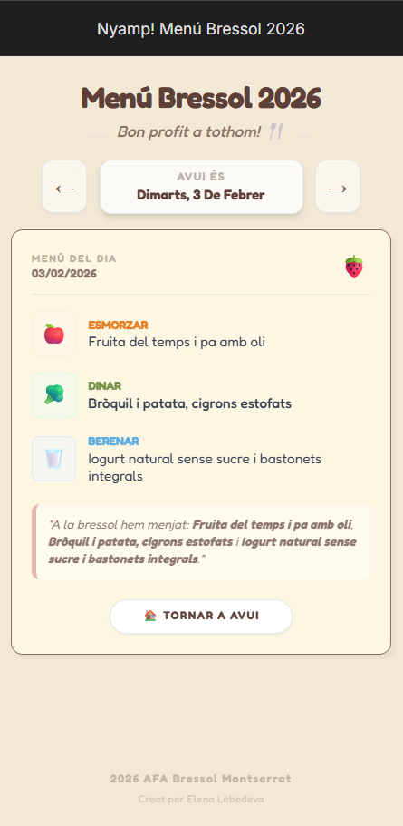
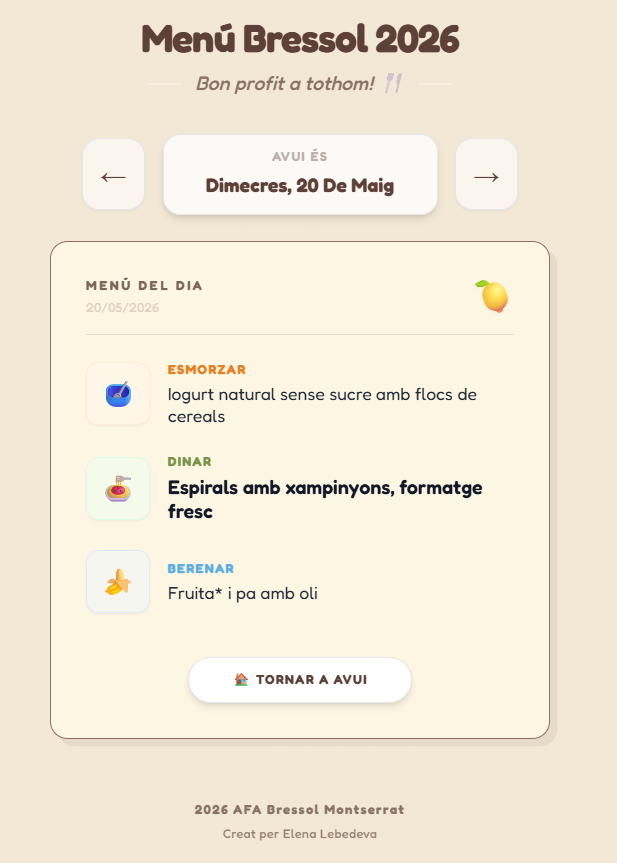

# AI Solutions Lab: LLM-Powered Prototypes

This repository showcases functional applications and custom tools developed using **Google AI Studio** and **Gemini**. These projects demonstrate my proficiency in "Vibe Coding"—using natural language to architect, iterate, and deploy AI-driven solutions for complex operational, environmental, and sociological challenges.

## 🚀 Featured Applications

### 1. Eco Footprint Visualizer
**[Launch Interactive Web App](https://eco-footprint-visualizer-by-elena-lebedeva-511806810573.us-west1.run.app/)**

**Recognition:** *Selected by the Game Changers Institute for the 2026 Volunteer Showcase.*

* **The Objective:** To transform abstract environmental data into a tangible, motivating experience. The app visualizes the collective impact of dietary shifts, scaling from a single individual to a global population of 8.2 billion.
* **The Innovation (4-Tier Analogy System):** I architected a logic system that translates raw metrics into relatable, real-world landmarks:
    * **Tier 1 (Cultural):** e.g., The area of the Louvre Museum.
    * **Tier 2 (Mega-City):** e.g., The area of Tokyo.
    * **Tier 3 (National):** e.g., The area of Costa Rica or the volume of Lake Titicaca.
    * **Tier 4 (Global):** e.g., The entire Amazon Rainforest or multiples of the global wild panda population.
* **The Logic:** Built using **"Vibe Coding" in Google AI Studio**, directing **Gemini 1.5 Pro** to handle complex delta-calculations. The app features interactive KPIs that, when clicked, reveal custom photography and analogies to ground the data in reality.

**Project Documentation:**
* 
* [View Full Technical Presentation (PDF)](Eco%20Footprint%20Visualizer_presentation.pdf)

---

---

### 2. 🍎 Nyamp! Menú Bressol (Kindergarten Menu Tracker)
**[Launch Interactive Web App](https://nyamp-men-bressol-2026-511806810573.us-west1.run.app/)**

* **The Objective:** To solve a localized, fragmented data problem for a school community. Previously, tracking the daily kindergarten menu required parents to manually cross-reference three separate, static PDFs (a school calendar mapping week numbers, and two seasonal 8-week rotation matrices).
* **The Logic:** Built using **"Vibe Coding" in Google AI Studio**. By leveraging the reasoning capabilities of **Gemini 1.5 Pro**, I engineered a lightweight application that ingests and automates the underlying calendar rules and seasonal schedules. The app dynamically tracks the exact rotational week and extracts the correct day's menu with zero manual input required.

* **Key Impact (Community Utility):** Successfully deprecated the reliance on scattered PDFs, creating a clean, centralized "single source of truth." What began as a personal workflow optimization is now a live, highly adopted tool deployed via Google Cloud Run, serving the wider parent community at the school. 
**Project Documentation:**
* 
* *Diagram: Translating fragmented static PDFs into a dynamic UI using Gemini.*
* 
* 
---

## 🛠 Technical Framework: Vibe Coding
In 2026, technical value lies in **Intent Alignment**. These projects are built by directing LLMs through iterative feedback loops to ensure the technical output meets strict sociological and business standards.

**Skills Demonstrated:**
* **Prompt Architecture:** Structuring complex, multi-layered instructions for consistent output.
* **Rapid Prototyping:** Accelerating the development lifecycle from concept to a deployed web application.
* **Human-AI Collaboration:** Acting as the "Human-in-the-loop" to audit AI logic and align data visualization with user empathy.

---

## 🔬 Professional Context
These prototypes serve as a technical "sandbox" for the large-scale AI Governance and Quality ecosystems I manage professionally. They demonstrate a commitment to continuous innovation in the **AI Quality** and **Data for Good** sectors, proving that AI can bridge the gap between raw data and human understanding.

***
[**LinkedIn Profile**](https://www.linkedin.com/in/elena-lebedeva-ub/) | [**Tableau Portfolio**](https://public.tableau.com/app/profile/elena.lebedeva/vizzes)
